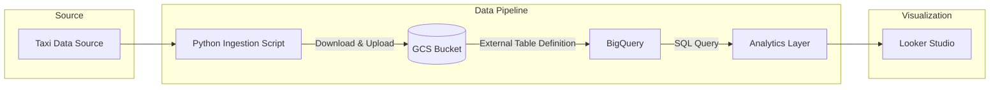

### Building Notes:

1. First our python script needs to authenticate to use the bucket(Google Cloud Storage). For non-human users, we can use a **service account** and generate a JSON file that the Python script will use as the credential. Other types of accounts exist: _User Account_ is for individual person, _Workload Identity_ is a certificate-controlled API key-less way for containers, serverless functions or pipelines to use.
  - Creating a key may be blocked in the organizational level. To change it from 'enforced' to 'not enforced', go to 'organization policies' page and make changes here(manage policy > override > new rule):
  - 
2. Install the necessary libraries: `python3 -m pip install --upgrade google-api-python-client google-auth-httplib2 google-auth-oauthlib`

### Using Airflow DAGs

1. First make a service account with _Composer Worker_ role (Grant a service account this role with command: ` gcloud projects add-iam-policy-binding GCP-PROJECT-NAME-ID --member="serviceAccount:SERVICE-ACCOUNT-NAME@GCP-PROJECT-NAME-ID.iam.gserviceaccount.com" 
--role="roles/composer.worker"
2.  
